# 猫师自然码并击

## 简介

自然码双拼+虎码辅助+二笔辅助+带声调+并击输入的方案

## 平台

依赖Rime，部署时请备份好自己当前的方案。

## 并击输入：

每次并击都是输入2码，输入的编码只会是偶数，不会是奇数

## 收录文字：

只收录了8105通用规范汉字

## 编码组成：<code>aaBBBBCC</code>

### <code>aa</code>：音码，为自然码双拼，由一个声母+一个韵母组成，通过大小写表示声调（有三种组合方式）

- aa：轻声、一声
- aA：二声、三声
- Aa：四声

### <code>BBBB</code>：虎码形码，全码4码的辅助码（必须是全大写，可以是双码辅，也可以是四码辅）

- BB：双虎码辅助
- BBBB：全虎码辅助（虎码中不足4码的，用末尾码补全到4码）

### <code>CC</code>：二笔码，由首两笔画，和末两笔画组成（必须是全大写）

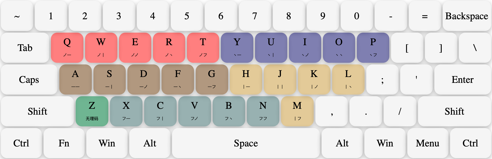

## 无理码：

无理码只会出现在末尾，用来排除重码，用到的只有7个字。用无理码过滤掉最后的重码达到所有字编码唯一，即全字无重，非“出简让全”。

```tex
[岂------MG	==	屺------MG]	=>	[屺------MZ]
[旱------MS	==	旰------MS]	=>	[旰------MZ]
[盯------MS	==	町------MS]	=>	[町------MZ]
[赢------YB	==	嬴------YB]	=>	[嬴------YZ]
[縠------SB	==	觳------SB]	=>	[觳------SZ]
[赅------MR	==	晐------MR]	=>	[晐------MZ]
[嗜------MA	==	啫------MA]	=>	[啫------MZ]
```

## 特殊码元

在音码中做非“韵母”时的特殊用途，即作为第一码使用时

| 码元 |         组合         | 功能                                                     |
|:--:|:------------------:|:-------------------------------------------------------|
| a  |     [ab](#云词库)     | 触发一次云词库查询（百度）                                          |
|    |   [ac](#词库输入联想)    | 词库输入联想，类似手机上输入法输入一个词后，会自动联想可能输入的词                      |
|    |    [ad](#联想相关词)    | 触发一次云联想（百度）获取到相关词                                      |
|    |     [ae](#词翻译)     | 翻译当前选中的候选词到英文                                          |
|    |   [af](#保存输入状态)    | 保存当前输入状态                                               |
|    |  [ag](#恢复之前输入状态)   | 恢复之前保存的输入状态                                            |
|    |   [ap](#置顶当前选择词)   | 置顶当前选择词/取消置顶当前选择词                                      |
|    |   [aq](#英文单词输入)    | 英文单词输入，单词候选为小写下划线模式、大写下划线模式、小驼峰模式、大驼峰模式                |
|    |   [ar](#清空输入编码)    | 清空当前输入编码，相当于<kbd>ESC</kbd>键                            |
|    |   [as](#日期时间输入)    | 日期输入模式，可以输入日期、时间、节气、农历等等                               |
|    |   [at](#大写数字输入)    | 大写数字输入模式，输入大写数字                                        |
|    | [au](#Unicode编码输入) | <code>Unicode</code>编码输入                               |
|    |   [av](#删除输入编码)    | 删除一次并击编码（2个编码），相当于<kbd>BACKSPACE</kbd>键                |
|    |   [aw](#快捷短语输入)    | 快捷短语输入，使用首拼方式输入                                        |
|    |   [ax](#系统信息输入)    | 输入法系统信息输入，候选有当前版本、当前方案、当前平台名称、<code>librime</code>版本等等 |
|    |    [ay](#拼音输入)     | 拼音输入，候选为双拼对应的全拼，4个声调                                   |
|    |  [az](#纯辅助码输入模式)   | 纯辅助码输入，使用辅助码输入不认识的字                                    |
| o  |    [or](#以词定字)     | 以词定字，上屏当前候选词中的首字                                       |
|    |    [oe](#以词定字)     | 以词定字，上屏当前候选词中的尾字                                       |
|    |    [ow](#编码输出)     | 输入当前候选的全编码，按码表格式输出                                     |
|    |   [oq](#详细信息输出)    | 输入当前候选的详细信息，读音、虎码拆分、二笔拆分、一击码                           |
|    |    [og](#选择候选项)    | 选择候选项，选择第1个候选项，相当于<kbd>SPACE</kbd>键，会记录到用户词库           |
|    |    [of](#选择候选项)    | 选择候选项，选择第2个候选项，会记录到用户词库                                |
|    |    [od](#选择候选项)    | 选择候选项，选择第3个候选项，会记录到用户词库                                |
|    |    [os](#选择候选项)    | 选择候选项，选择第4个候选项，会记录到用户词库                                |
|    |    [oa](#选择候选项)    | 选择候选项，选择第5个候选项，会记录到用户词库                                |
|    |    [ob](#选择候选项)    | 选择候选项，选择第6个候选项，会记录到用户词库                                |
|    |    [ov](#选择候选项)    | 选择候选项，选择第7个候选项，会记录到用户词库                                |
|    |    [oc](#选择候选项)    | 选择候选项，选择第8个候选项，会记录到用户词库                                |
|    |    [ox](#选择候选项)    | 选择候选项，选择第9个候选项，会记录到用户词库                                |
|    |    [oz](#选择候选项)    | 选择候选项，选择第10个候选项，会记录到用户词库                               |
|    |    [oG](#选择候选项)    | 选择候选项，选择第11个候选项，会记录到用户词库                               |
|    |    [oF](#选择候选项)    | 选择候选项，选择第12个候选项，会记录到用户词库                               |
|    |    [oD](#选择候选项)    | 选择候选项，选择第13个候选项，会记录到用户词库                               |
|    |    [oS](#选择候选项)    | 选择候选项，选择第14个候选项，会记录到用户词库                               |
|    |    [oA](#选择候选项)    | 选择候选项，选择第15个候选项，会记录到用户词库                               |
|    |    [oB](#选择候选项)    | 选择候选项，选择第16个候选项，会记录到用户词库                               |
|    |    [oV](#选择候选项)    | 选择候选项，选择第17个候选项，会记录到用户词库                               |
|    |    [oC](#选择候选项)    | 选择候选项，选择第18个候选项，会记录到用户词库                               |
|    |    [oX](#选择候选项)    | 选择候选项，选择第19个候选项，会记录到用户词库                               |
|    |    [oZ](#选择候选项)    | 选择候选项，选择第20个候选项，会记录到用户词库                               |
| e  |    [et](#包裹上屏)     | 直接上屏当前候选，并给当前候选加上<code>（）</code>号                      |
|    |    [er](#包裹上屏)     | 直接上屏当前候选，并给当前候选加上<code>《》</code>号                      |
|    |    [ew](#包裹上屏)     | 直接上屏当前候选，并给当前候选加上<code>“”</code>号                      |
|    |    [eq](#包裹上屏)     | 直接上屏当前候选，并给当前候选加上<code>‘’</code>号                      |
|    |    [eg](#直接上屏)     | 直接上屏候选项，上屏第1个候选项                                       |
|    |    [ef](#直接上屏)     | 直接上屏候选项，上屏第2个候选项                                       |
|    |    [ed](#直接上屏)     | 直接上屏候选项，上屏第3个候选项                                       |
|    |    [es](#直接上屏)     | 直接上屏候选项，上屏第4个候选项                                       |
|    |    [ea](#直接上屏)     | 直接上屏候选项，上屏第5个候选项                                       |
|    |    [eb](#直接上屏)     | 直接上屏候选项，上屏第6个候选项                                       |
|    |    [ev](#直接上屏)     | 直接上屏候选项，上屏第7个候选项                                       |
|    |    [ec](#直接上屏)     | 直接上屏候选项，上屏第8个候选项                                       |
|    |    [ex](#直接上屏)     | 直接上屏候选项，上屏第9个候选项                                       |
|    |    [ez](#直接上屏)     | 直接上屏候选项，上屏第10个候选项                                      |
|    |    [eG](#直接上屏)     | 直接上屏候选项，上屏第11个候选项                                      |
|    |    [eF](#直接上屏)     | 直接上屏候选项，上屏第12个候选项                                      |
|    |    [eD](#直接上屏)     | 直接上屏候选项，上屏第13个候选项                                      |
|    |    [eS](#直接上屏)     | 直接上屏候选项，上屏第14个候选项                                      |
|    |    [eA](#直接上屏)     | 直接上屏候选项，上屏第15个候选项                                      |
|    |    [eB](#直接上屏)     | 直接上屏候选项，上屏第16个候选项                                      |
|    |    [eV](#直接上屏)     | 直接上屏候选项，上屏第17个候选项                                      |
|    |    [eC](#直接上屏)     | 直接上屏候选项，上屏第18个候选项                                      |
|    |    [eX](#直接上屏)     | 直接上屏候选项，上屏第19个候选项                                      |
|    |    [eZ](#直接上屏)     | 直接上屏候选项，上屏第20个候选项                                      |
| i  |                    | 声母<code>ch</code>                                      |
| u  |                    | 声母<code>sh</code>                                      |
| v  |                    | 声母<code>zh</code>                                      |
| r  |   [rf](#快速移动光标)    | 移动光标，快速移动光标到第2个字后                                      |
|    |   [rd](#快速移动光标)    | 移动光标，快速移动光标到第3个字后                                      |
|    |   [rs](#快速移动光标)    | 移动光标，快速移动光标到第4个字后                                      |
|    |   [ra](#快速移动光标)    | 移动光标，快速移动光标到第5个字后                                      |
|    |   [rb](#快速移动光标)    | 移动光标，快速移动光标到第6个字后                                      |
|    |   [rv](#快速移动光标)    | 移动光标，快速移动光标到第7个字后                                      |
|    |   [rc](#快速移动光标)    | 移动光标，快速移动光标到第8个字后                                      |
|    |   [rx](#快速移动光标)    | 移动光标，快速移动光标到第9个字后                                      |
|    |   [rz](#快速移动光标)    | 移动光标，快速移动光标到第10个字后                                     |
| _  |    [__](#重复上屏)     | 重复上次上屏，上次上屏内容再次上屏                                      |

## 输入方式说明

### 纯双拼输入模式：

纯双拼输入，左手输入声母+右手输入韵母，使用大小写规则表示声调。

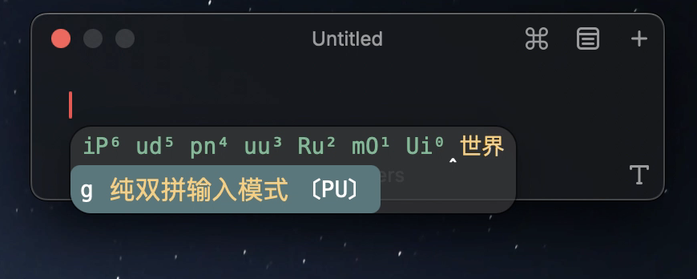

### 双拼加辅输入模式：

输入音码之后，使用双大写输入辅助码，最多可加3次（虎码辅2次，二笔辅1次）。

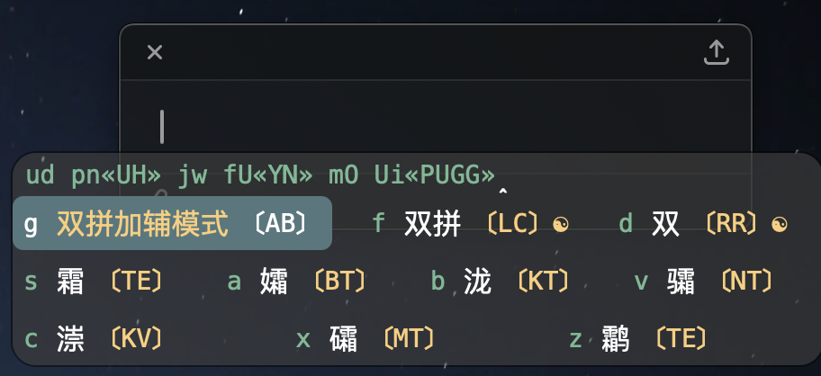

### 纯辅助码输入模式：

用来打不认识的字，使用<code>az</code>激活模式，然后直接用辅助码打字，只能打单字，输入<code>az</code>后会自动将当前候选的内容顶上屏。


### 云词库：

在<code>zrm.schema.yaml</code>文件中，<code>- lua_translator@*baidu_translator</code>处取消注释即开启功能，用<code>ab</code>
触发云词库查询，调用的是百度云词库。需要额外依赖：请查看<code>lib</code>目录下<code>依赖说明.txt</code>。

- 触发后，带有<code>〔㉿〕</code>标识的即是云词库的词：

  

### 词库输入联想：

在<code>zrm.schema.yaml</code>文件中，<code>- lua_translator@*auto_translator</code>处取消注释即开启功能，上屏（只能使用<code>e</code>临时上屏模式，因为<code>
o</code>上屏模式只负责记录）之后会根据词库经常连续打的词进行联想，无需手动输入<code>ac</code>会自动触发，日常连续打过的词会被记录，未避免误联想，设定连续打过10次以上的即为满足自动联想的词。

- 例如输入“查看”：

  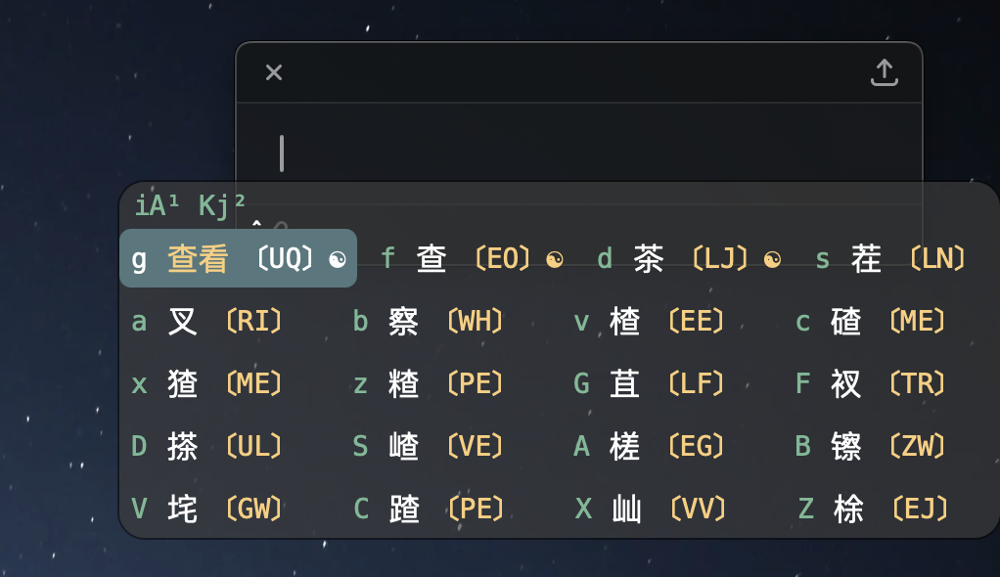

- 上屏之后，后自动联想连续输入过的词：

  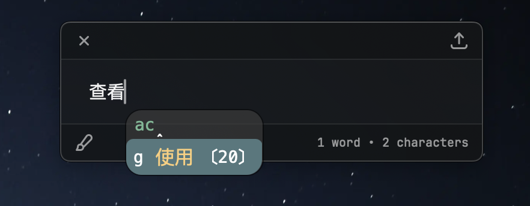

- 继续上屏继续联想，直到不满足条件之后会停下，也可以按<kbd>ESC</kbd>或<kbd>ENTER</kbd>键退出，或使用<code>ar</code>组合也可以退出：

  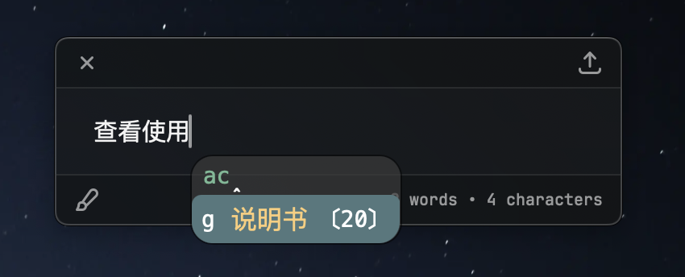

### 联想相关词：

在<code>zrm.schema.yaml</code>文件中，<code>- lua_translator@*english_translator</code>处取消注释即开启功能，用<code>ad</code>
触发词联想查询。需要额外依赖：请查看<code>lib</code>目录下<code>依赖说明.txt</code>。

- 例如，输入“复仇者”：

  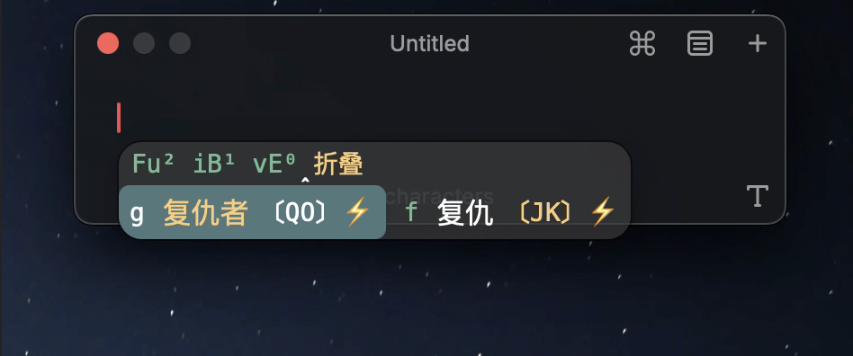

- 触发后，带有<code>〔E〕</code>标识的即是联想的词：

  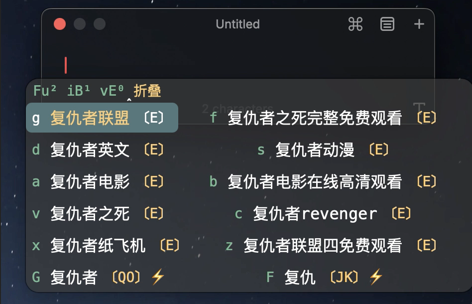

### 词翻译：

在<code>zrm.schema.yaml</code>文件中，<code>- lua_translator@*c2e_translator</code>处取消注释即开启功能，用<code>ae</code>
触发词翻译，只能中翻英。需要额外依赖：请查看<code>lib</code>目录下<code>依赖说明.txt</code>。

- 例如，输入商品：

  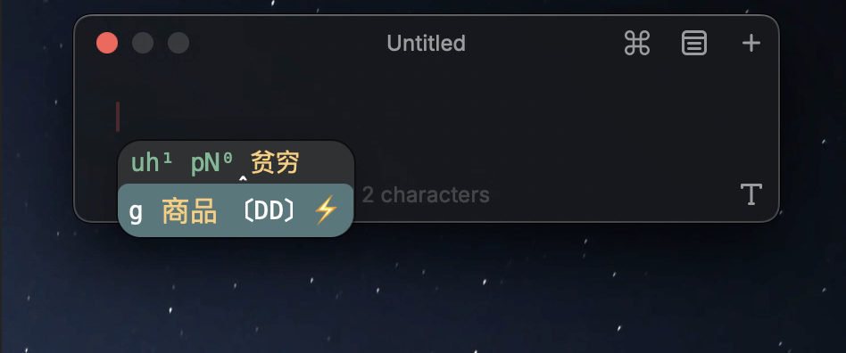

- 触发后，即是翻译后的内容：

  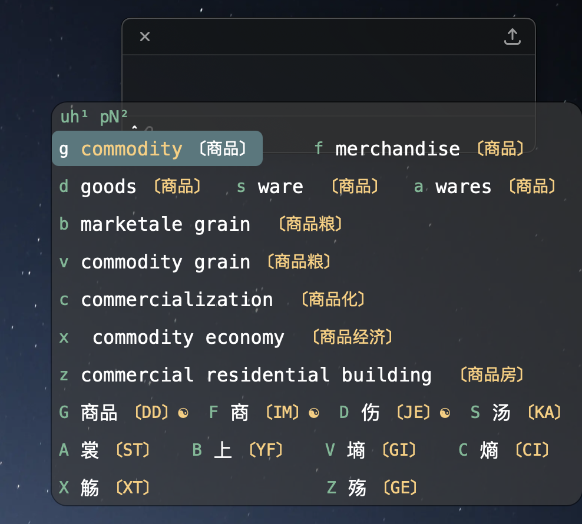

### 保存输入状态：

使用<code>af</code>清空当前输入编码，等同于并把当前的编码保存起来，后续可恢复。

### 恢复之前输入状态：

使用<code>ag</code>将之前保存的编码恢复。

### 置顶当前选择词：

使用<code>ap</code>置顶当前选择词，已置顶的词则是取消置顶。

### 英文单词输入：

在<code>zrm.schema.yaml</code>文件中，<code>- lua_translator@*english_translator</code>处取消注释即开启功能，用<code>aq</code>触发，使用<code>'</code>
号分割单词。候选中有小写下划线模式、大写下划线模式、小驼峰模式、大驼峰模式。


### 清空输入编码：

使用<code>ar</code>清空编码，等同于<kbd>ESC</kbd>或<kbd>ENTER</kbd>键。

### 日期时间输入：

在<code>zrm.schema.yaml</code>文件中，<code>- lua_translator@*date_translator</code>处取消注释即开启功能，使用<code>as</code>激活模式，打出当前日期、时间、农历、节气等等。

- 日期：rq

  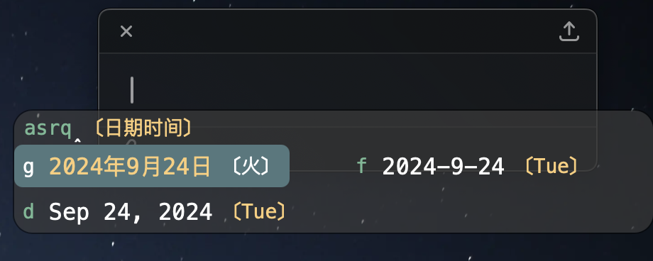

- 时间：uj

  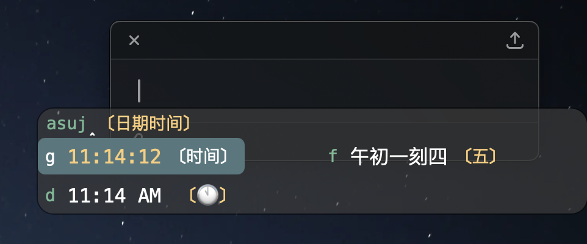

- 农历：nl

  

- 八字：bz

  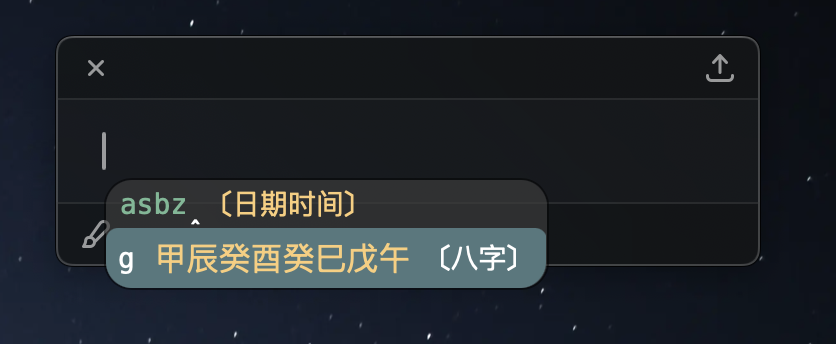

- 今时：ju

  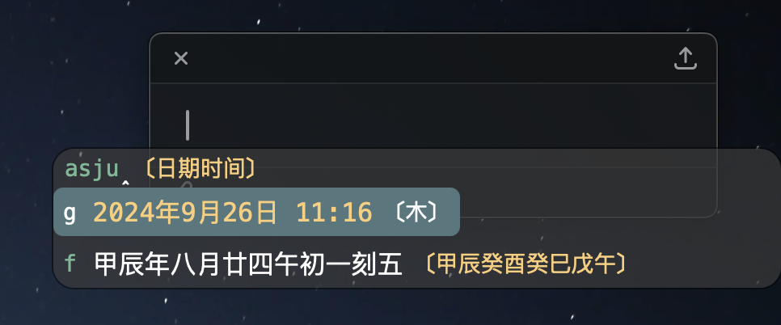

- 朔望：uw

  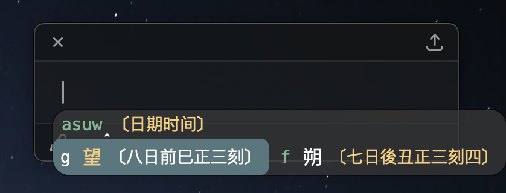

- 节气：jq

  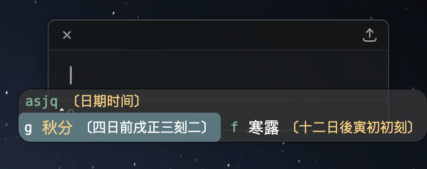

- 月轮：yl

  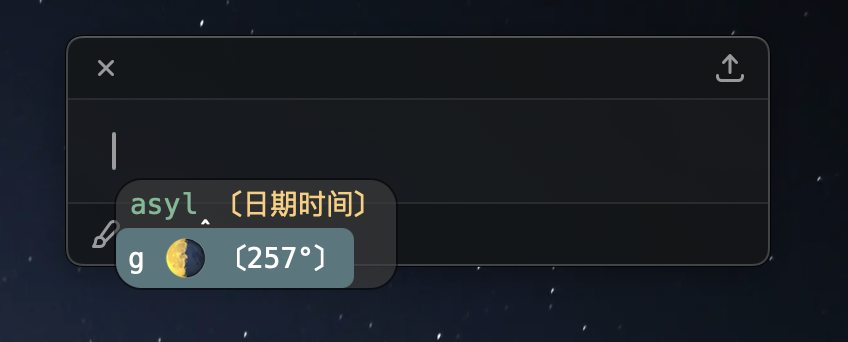

- 时区：uq

  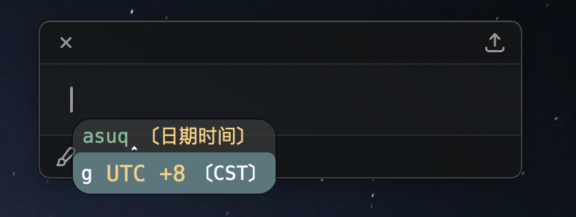

### 大写数字输入：

在<code>zrm.schema.yaml</code>文件中，<code>- lua_translator@*number_translator</code>处取消注释即开启功能，使用<code>at</code>激活将数字转为大写。

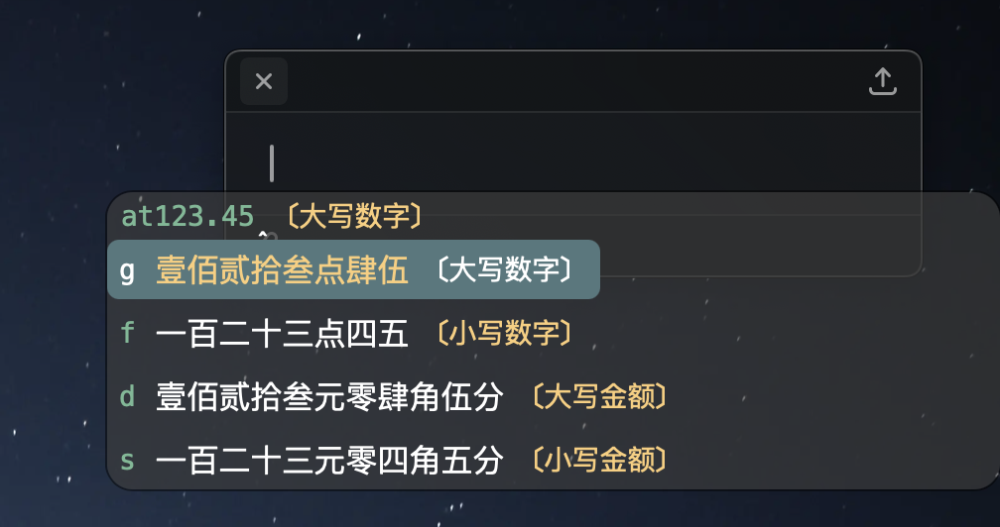

### Unicode编码输入：

在<code>zrm.schema.yaml</code>文件中，<code>- lua_translator@*unicode_translator</code>处取消注释即开启功能，使用<code>au</code>激活，使用 Unicode编码输入。


### 删除输入编码：

使用<code>av</code>删除1次并击的编码，等同于<kbd>BACKSPACE</kbd>键。

### 快捷短语输入：

使用<code>aw</code>激活，输入首拼字母，必须4字以上的词，对应为第1、2、3、4码对应第1、2、3、4个字的首拼字母，第5、6码对应词最后2个字的首拼字母。首拼字母必须是大写，短语模式不区分声调。

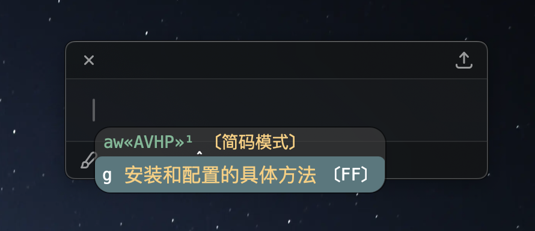

### 系统信息输入：

使用<code>ax</code>激活，候选中有当前系统的详细信息。

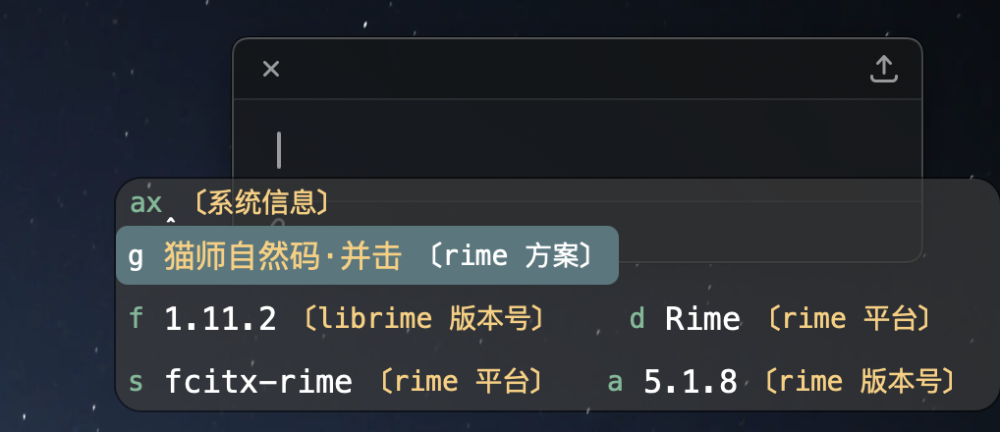

### 拼音输入：

使用<code>ay</code>激活，候选中有当前双拼编码对应的全拼的4个声调。

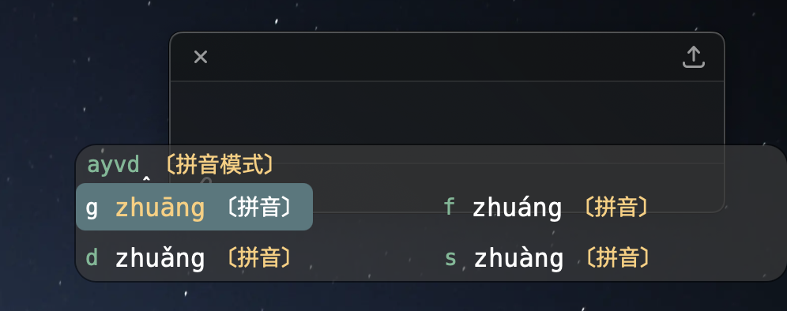

### 以词定字：

使用<code>or</code>和<code>oe</code>，上屏词中首字或词中尾字。

- 使用<code>or</code>上屏“固”字：

  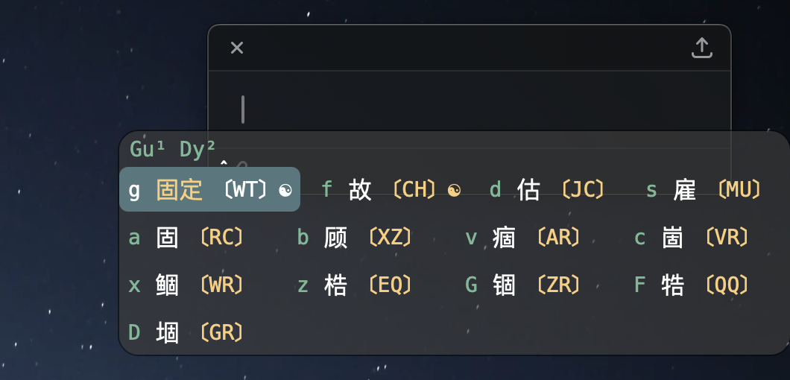

- 使用<code>oe</code>上屏“定”字：

  

### 编码输出：

使用<code>ow</code>输出当前候选的词库编码格式。

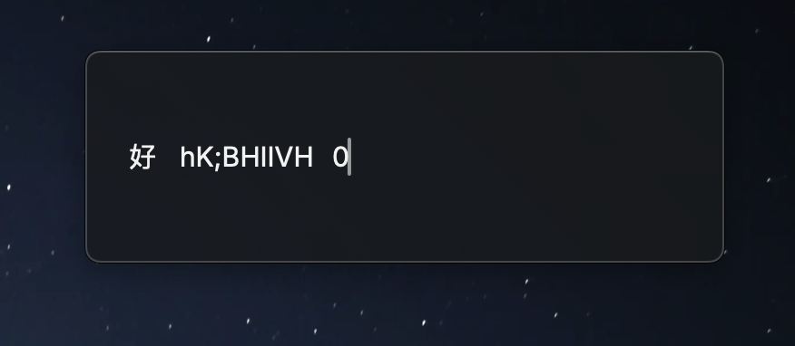

### 详细信息输出：

使用<code>ow</code>输出当前候选的详细信息：读音、虎码拆分、二笔拆分、一击码等。

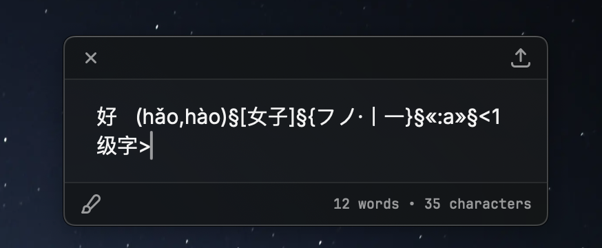

### 选择候选项：

使用<code>o</code>和上对应字母上屏候选项，上屏的候选词后写入用户词库。

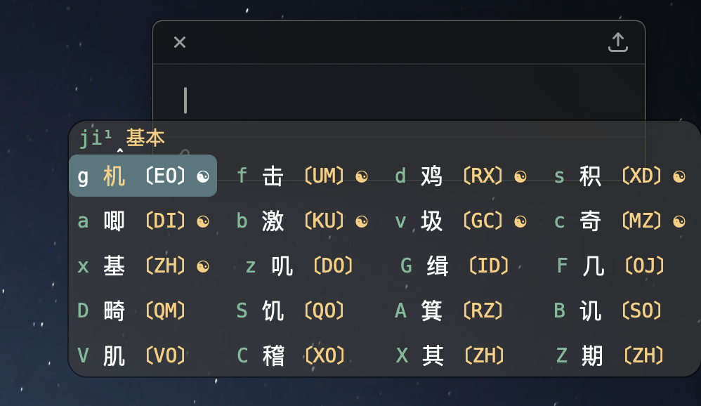

1-10选键位示意图，11-20选，则需要使用大写键位

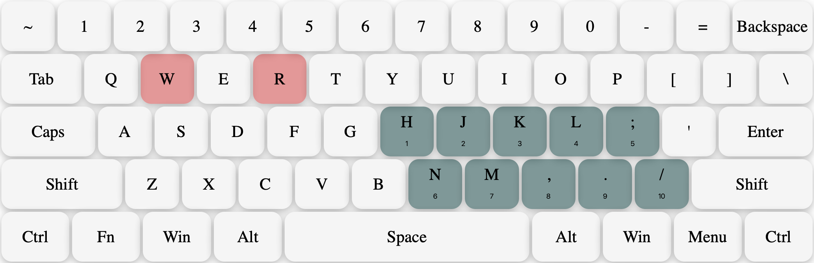

### 包裹上屏：

使用<code>e</code>和上对应字母直接上屏候选项，并使用符号包裹。

- <code>et</code>，用<code>（）</code>号包裹
- <code>er</code>，用<code>《》</code>号包裹
- <code>ew</code>，用<code>“”</code>号包裹
- <code>eq</code>，用<code>‘’</code>号包裹

### 直接上屏：

使用<code>e</code>和上对应字母直接上屏候选项，不后产生任何记录，也是“词库输入联想”功能的触发方式。


1-10选键位示意图，11-20选，则需要使用大写键位

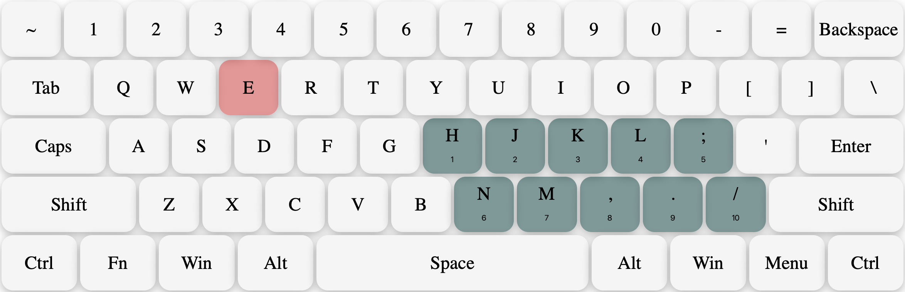

### 快速移动光标：

输入编码时移动光标可用<kbd>左SHIFT</kbd>将光标向左移动一个字，<kbd>右SHIFT</kbd>将光标向右移动一个字，也可使用<code>r</code>加上对应字母在2~
10个字中指定移动，为什么是从2开始？因为移动到第1个字后只需要按<kbd>右SHIFT</kbd>即可。输入编码时，编码上会有上标<code>1-9</code>提示位置。

- 编码位置提示：

  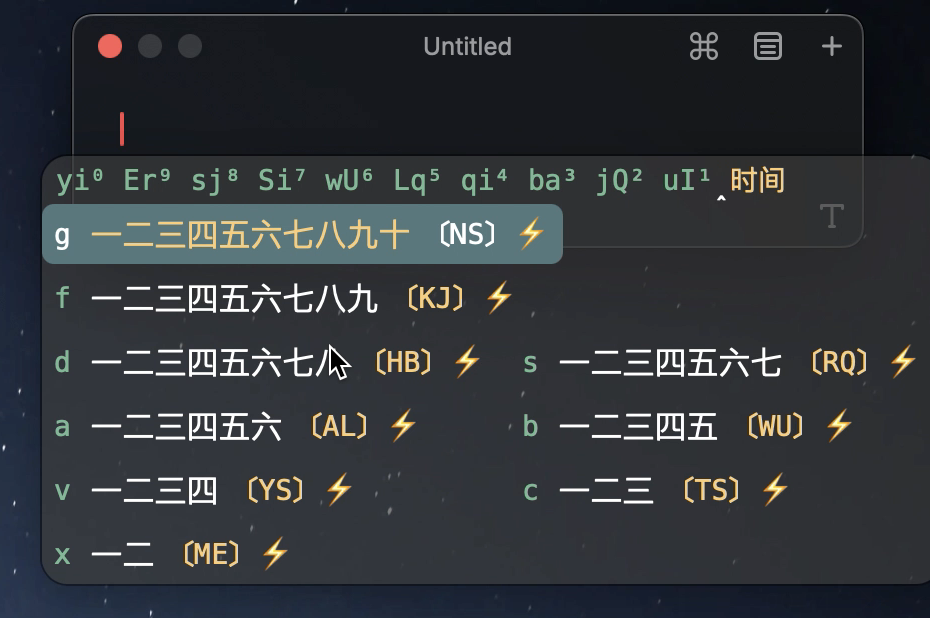

- 指定移动键位说明：

  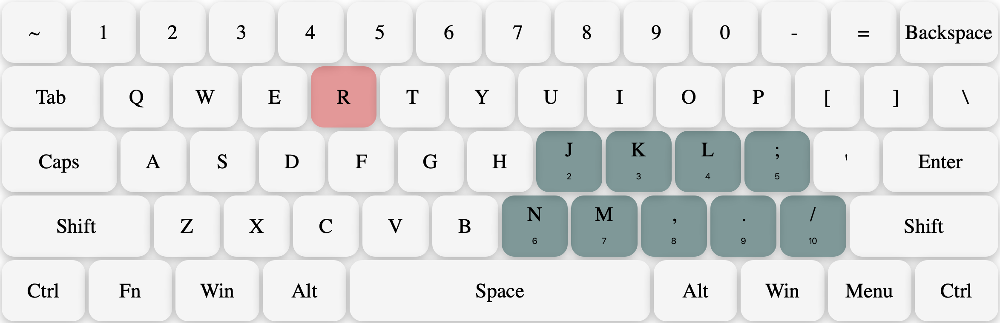

### 输入预测：

在<code>zrm.schema.yaml</code>文件中，<code>- lua_translator@*word_translator</code>处取消注释即开启功能，输入编码时会根据输入的编码预测可能输入的词，按<kbd>
TAB</kbd>键直接将候选项和预测的词一起上屏。

- 例如，输入“安装”时，给出预测可能会输入“安装和配置的具体方法”

  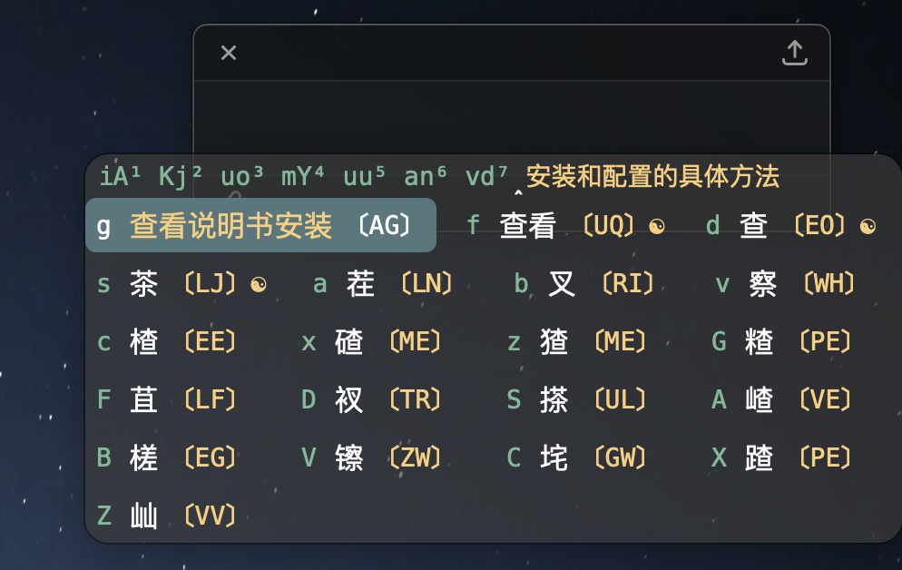

- 按<kbd>TAB</kbd>键可直接上屏“查看说明书安装和配置的具体方法”

### 一击码：

使用特定组合，直接上屏，如果在有候选项的情况下使用一击码，则会将当前候选内容顶上屏。

- 一击字：共<code>5760</code>个字，没有规律。不建议记。详细请参考文件<code>zrm_one.dict.yaml</code>
- 一击词：共<code>184</code>组词，没有规律，组合都带空格。可以少记。详细请参考文件<code>zrm_fu.dict.yaml</code>
- 标点符号：共<code>60</code>个，左边<code>30</code>个组合为半角符号，右边<code>30</code>组合为全角符号。需要记忆。详细请参考文件<code>zrm_fu.dict.yaml</code>
- 字母数字：<code>26</code>个小写字母，<code>26</code>个大写字母，<code>10</code>个数字。
- 左边大写键位输出对应小写字母，右边大写键位输出对应大写字母。左边数字键位输出对应半角数字，右边数字键位输出对应全角数字。详细请参考文件<code>
  zrm_fu.dict.yaml</code>

### 重复上屏：

使用<code>__</code>重复上次上屏内容。

### 其他：

- 带有<code>〔〶〕</code>标识的即是长词联想

  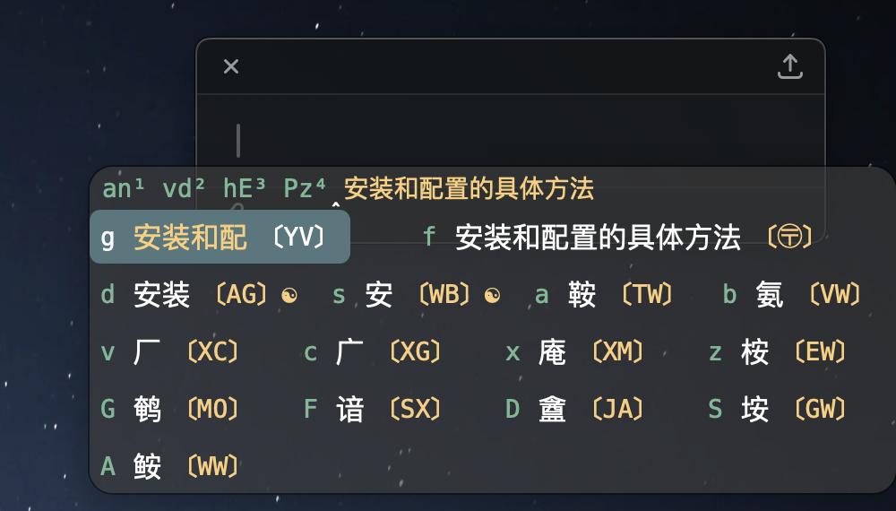

- 带有<code>⚡</code>标识的即是用户词库的词

## 码元及键位

<code>26小写字母</code>+<code>26大写字母</code>+<code>10数字</code>+<code>30符号</code>+<code>下划线</code>=<code>93个</code>

| 序号 | 码元 |                 左键位                  |                 右键位                  |
|:--:|:--:|:------------------------------------:|:------------------------------------:|
| 1  | a  |             <kbd>a</kbd>             |             <kbd>;</kbd>             |
| 2  | b  |             <kbd>b</kbd>             |             <kbd>n</kbd>             |
| 3  | c  |             <kbd>c</kbd>             |             <kbd>,</kbd>             |
| 4  | d  |             <kbd>d</kbd>             |             <kbd>k</kbd>             |
| 5  | e  |             <kbd>e</kbd>             |             <kbd>i</kbd>             |
| 6  | f  |             <kbd>f</kbd>             |             <kbd>j</kbd>             |
| 7  | g  |             <kbd>g</kbd>             |             <kbd>h</kbd>             |
| 8  | h  |       <kbd>w</kbd><kbd>f</kbd>       |       <kbd>o</kbd><kbd>j</kbd>       |
| 9  | i  |       <kbd>w</kbd><kbd>e</kbd>       |       <kbd>o</kbd><kbd>i</kbd>       |
| 10 | j  |       <kbd>d</kbd><kbd>f</kbd>       |       <kbd>k</kbd><kbd>j</kbd>       |
| 11 | k  | <kbd>s</kbd><kbd>d</kbd><kbd>f</kbd> | <kbd>l</kbd><kbd>k</kbd><kbd>j</kbd> |
| 12 | l  |       <kbd>s</kbd><kbd>f</kbd>       |       <kbd>l</kbd><kbd>j</kbd>       |
| 13 | m  |       <kbd>c</kbd><kbd>v</kbd>       |       <kbd>,</kbd><kbd>m</kbd>       |
| 14 | n  |       <kbd>s</kbd><kbd>c</kbd>       |       <kbd>l</kbd><kbd>m</kbd>       |
| 15 | o  |       <kbd>w</kbd><kbd>r</kbd>       |       <kbd>o</kbd><kbd>u</kbd>       |
| 16 | p  |       <kbd>q</kbd><kbd>r</kbd>       |       <kbd>p</kbd><kbd>u</kbd>       |
| 17 | q  |             <kbd>q</kbd>             |             <kbd>p</kbd>             |
| 18 | r  |             <kbd>r</kbd>             |             <kbd>u</kbd>             |
| 19 | s  |             <kbd>s</kbd>             |             <kbd>l</kbd>             |
| 20 | t  |             <kbd>t</kbd>             |             <kbd>y</kbd>             |
| 21 | u  |       <kbd>e</kbd><kbd>r</kbd>       |       <kbd>i</kbd><kbd>u</kbd>       |
| 22 | v  |             <kbd>v</kbd>             |             <kbd>m</kbd>             |
| 23 | w  |             <kbd>w</kbd>             |             <kbd>o</kbd>             |
| 24 | x  |             <kbd>x</kbd>             |             <kbd>.</kbd>             |
| 25 | y  |       <kbd>e</kbd><kbd>f</kbd>       |       <kbd>i</kbd><kbd>j</kbd>       |
| 26 | z  |             <kbd>z</kbd>             |             <kbd>/</kbd>             |
| 27 | A  |       <kbd>a</kbd><kbd>v</kbd>       |       <kbd>;</kbd><kbd>n</kbd>       |
| 28 | B  |       <kbd>q</kbd><kbd>w</kbd>       |       <kbd>p</kbd><kbd>o</kbd>       |
| 29 | C  |       <kbd>x</kbd><kbd>b</kbd>       |       <kbd>.</kbd><kbd>n</kbd>       |
| 30 | D  |       <kbd>d</kbd><kbd>v</kbd>       |       <kbd>k</kbd><kbd>n</kbd>       |
| 31 | E  |       <kbd>e</kbd><kbd>v</kbd>       |       <kbd>i</kbd><kbd>n</kbd>       |
| 32 | F  |       <kbd>s</kbd><kbd>g</kbd>       |       <kbd>l</kbd><kbd>h</kbd>       |
| 33 | G  |       <kbd>d</kbd><kbd>g</kbd>       |       <kbd>k</kbd><kbd>h</kbd>       |
| 34 | H  |       <kbd>a</kbd><kbd>r</kbd>       |       <kbd>o</kbd><kbd>j</kbd>       |
| 35 | I  | <kbd>w</kbd><kbd>e</kbd><kbd>f</kbd> | <kbd>o</kbd><kbd>i</kbd><kbd>j</kbd> |
| 36 | J  |       <kbd>x</kbd><kbd>f</kbd>       |       <kbd>.</kbd><kbd>j</kbd>       |
| 37 | K  | <kbd>s</kbd><kbd>d</kbd><kbd>f</kbd> | <kbd>l</kbd><kbd>k</kbd><kbd>j</kbd> |
| 38 | L  |       <kbd>s</kbd><kbd>r</kbd>       |       <kbd>l</kbd><kbd>u</kbd>       |
| 39 | M  |       <kbd>w</kbd><kbd>d</kbd>       |       <kbd>o</kbd><kbd>k</kbd>       |
| 40 | N  |       <kbd>s</kbd><kbd>e</kbd>       |       <kbd>l</kbd><kbd>i</kbd>       |
| 41 | O  |       <kbd>a</kbd><kbd>w</kbd>       |       <kbd>;</kbd><kbd>o</kbd>       |
| 42 | P  |       <kbd>q</kbd><kbd>f</kbd>       |       <kbd>p</kbd><kbd>j</kbd>       |
| 43 | Q  | <kbd>s</kbd><kbd>e</kbd><kbd>f</kbd> | <kbd>l</kbd><kbd>i</kbd><kbd>j</kbd> |
| 44 | R  |       <kbd>e</kbd><kbd>t</kbd>       |       <kbd>i</kbd><kbd>y</kbd>       |
| 45 | S  |       <kbd>s</kbd><kbd>v</kbd>       |       <kbd>l</kbd><kbd>n</kbd>       |
| 46 | T  |       <kbd>q</kbd><kbd>t</kbd>       |       <kbd>p</kbd><kbd>y</kbd>       |
| 47 | U  |       <kbd>a</kbd><kbd>f</kbd>       |       <kbd>;</kbd><kbd>j</kbd>       |
| 48 | V  |       <kbd>z</kbd><kbd>s</kbd>       |       <kbd>/</kbd><kbd>l</kbd>       |
| 49 | W  |       <kbd>w</kbd><kbd>v</kbd>       |       <kbd>o</kbd><kbd>n</kbd>       |
| 50 | X  |       <kbd>x</kbd><kbd>d</kbd>       |       <kbd>.</kbd><kbd>k</kbd>       |
| 51 | Y  |       <kbd>w</kbd><kbd>t</kbd>       |       <kbd>o</kbd><kbd>y</kbd>       |
| 52 | Z  |       <kbd>z</kbd><kbd>f</kbd>       |       <kbd>/</kbd><kbd>j</kbd>       |
| 53 | 1  |             <kbd>1</kbd>             |             <kbd>0</kbd>             |
| 54 | 2  |             <kbd>2</kbd>             |             <kbd>9</kbd>             |
| 55 | 3  |             <kbd>3</kbd>             |             <kbd>8</kbd>             |
| 56 | 4  |             <kbd>4</kbd>             |             <kbd>7</kbd>             |
| 57 | 5  |             <kbd>5</kbd>             |             <kbd>6</kbd>             |
| 58 | 6  |       <kbd>3</kbd><kbd>5</kbd>       |       <kbd>8</kbd><kbd>6</kbd>       |
| 59 | 7  |       <kbd>3</kbd><kbd>4</kbd>       |       <kbd>8</kbd><kbd>7</kbd>       |
| 60 | 8  |       <kbd>2</kbd><kbd>3</kbd>       |       <kbd>9</kbd><kbd>8</kbd>       |
| 61 | 9  |       <kbd>2</kbd><kbd>4</kbd>       |       <kbd>9</kbd><kbd>7</kbd>       |
| 62 | 0  |       <kbd>1</kbd><kbd>4</kbd>       |       <kbd>0</kbd><kbd>7</kbd>       |
| 63 | ,  |       <kbd>x</kbd><kbd>c</kbd>       |       <kbd>.</kbd><kbd>,</kbd>       |
| 64 | .  |       <kbd>x</kbd><kbd>v</kbd>       |       <kbd>.</kbd><kbd>m</kbd>       |
| 65 | !  |       <kbd>z</kbd><kbd>v</kbd>       |       <kbd>/</kbd><kbd>m</kbd>       |
| 66 | ?  |       <kbd>z</kbd><kbd>b</kbd>       |       <kbd>/</kbd><kbd>n</kbd>       |
| 67 | :  |       <kbd>a</kbd><kbd>s</kbd>       |       <kbd>;</kbd><kbd>l</kbd>       |
| 68 | ;  |       <kbd>a</kbd><kbd>d</kbd>       |       <kbd>;</kbd><kbd>k</kbd>       |
| 69 | '  | <kbd>a</kbd><kbd>s</kbd><kbd>d</kbd> | <kbd>;</kbd><kbd>l</kbd><kbd>k</kbd> |
| 70 | @  |       <kbd>z</kbd><kbd>x</kbd>       |       <kbd>/</kbd><kbd>.</kbd>       |
| 71 | $  |       <kbd>v</kbd><kbd>b</kbd>       |       <kbd>m</kbd><kbd>n</kbd>       |
| 72 | /  | <kbd>w</kbd><kbd>e</kbd><kbd>r</kbd> | <kbd>o</kbd><kbd>i</kbd><kbd>u</kbd> |
| 73 | \  | <kbd>q</kbd><kbd>w</kbd><kbd>e</kbd> | <kbd>p</kbd><kbd>o</kbd><kbd>i</kbd> |
| 74 | [  |       <kbd>r</kbd><kbd>t</kbd>       |       <kbd>u</kbd><kbd>y</kbd>       |
| 75 | ]  | <kbd>e</kbd><kbd>r</kbd><kbd>t</kbd> | <kbd>o</kbd><kbd>i</kbd><kbd>u</kbd> |
| 76 | (  |       <kbd>f</kbd><kbd>g</kbd>       |       <kbd>j</kbd><kbd>h</kbd>       |
| 77 | )  | <kbd>d</kbd><kbd>f</kbd><kbd>g</kbd> | <kbd>k</kbd><kbd>j</kbd><kbd>h</kbd> |
| 78 | <  |       <kbd>a</kbd><kbd>t</kbd>       |       <kbd>;</kbd><kbd>y</kbd>       |
| 79 | >  |       <kbd>a</kbd><kbd>g</kbd>       |       <kbd>;</kbd><kbd>h</kbd>       |
| 80 | {  |       <kbd>r</kbd><kbd>g</kbd>       |       <kbd>u</kbd><kbd>h</kbd>       |
| 81 | }  |       <kbd>e</kbd><kbd>g</kbd>       |       <kbd>i</kbd><kbd>h</kbd>       |
| 82 | =  |       <kbd>q</kbd><kbd>g</kbd>       |       <kbd>p</kbd><kbd>h</kbd>       |
| 83 | -  |       <kbd>w</kbd><kbd>g</kbd>       |       <kbd>o</kbd><kbd>h</kbd>       |
| 84 | ~  |       <kbd>d</kbd><kbd>c</kbd>       |       <kbd>k</kbd><kbd>m</kbd>       |
| 85 | \| |       <kbd>f</kbd><kbd>v</kbd>       |       <kbd>j</kbd><kbd>n</kbd>       |
| 86 | *  | <kbd>z</kbd><kbd>x</kbd><kbd>c</kbd> | <kbd>/</kbd><kbd>.</kbd><kbd>,</kbd> |
| 87 | +  | <kbd>c</kbd><kbd>v</kbd><kbd>b</kbd> | <kbd>,</kbd><kbd>m</kbd><kbd>n</kbd> |
| 88 | &  | <kbd>x</kbd><kbd>c</kbd><kbd>v</kbd> | <kbd>.</kbd><kbd>,</kbd><kbd>m</kbd> |
| 89 | #  |       <kbd>z</kbd><kbd>c</kbd>       |       <kbd>/</kbd><kbd>,</kbd>       |
| 90 | %  |       <kbd>q</kbd><kbd>e</kbd>       |       <kbd>p</kbd><kbd>i</kbd>       |
| 91 | `  |       <kbd>1</kbd><kbd>3</kbd>       |       <kbd>0</kbd><kbd>8</kbd>       |
| 92 | ^  |       <kbd>1</kbd><kbd>2</kbd>       |       <kbd>0</kbd><kbd>9</kbd>       |
| 93 | _  |       <kbd>r</kbd><kbd>f</kbd>       |       <kbd>u</kbd><kbd>j</kbd>       |

## 其他

- 开启<code>emoji</code>输出，使用<kbd>CTRL</kbd>+<kbd>q</kbd>快捷键。

  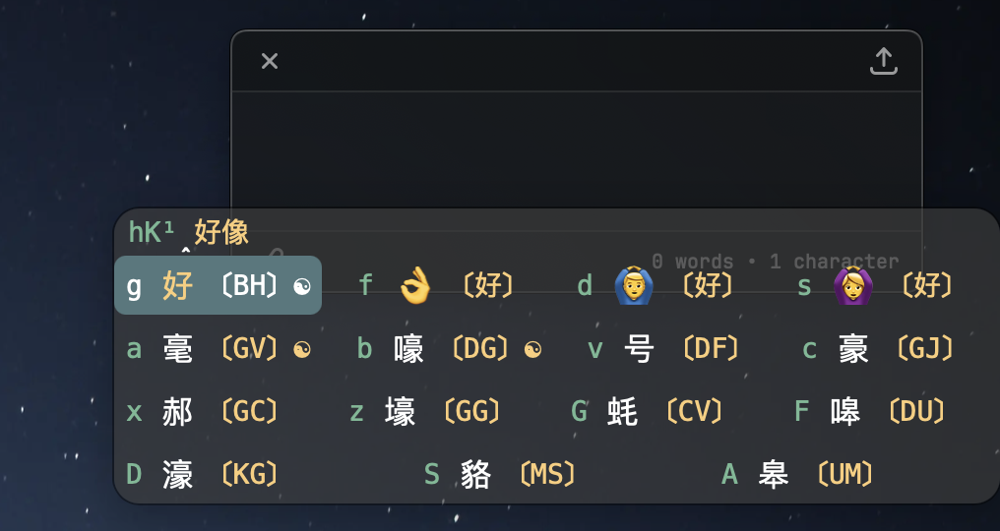

- 开启其他输出，使用<kbd>CTRL</kbd>+<kbd>w</kbd>快捷键。

  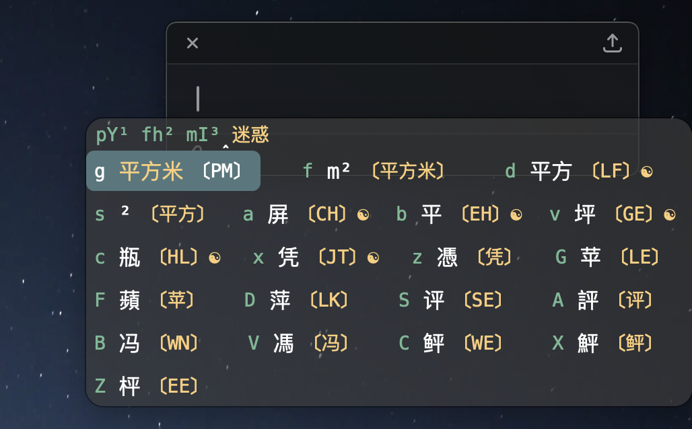

- 开启繁体字输出，使用<kbd>CTRL</kbd>+<kbd>e</kbd>快捷键。

  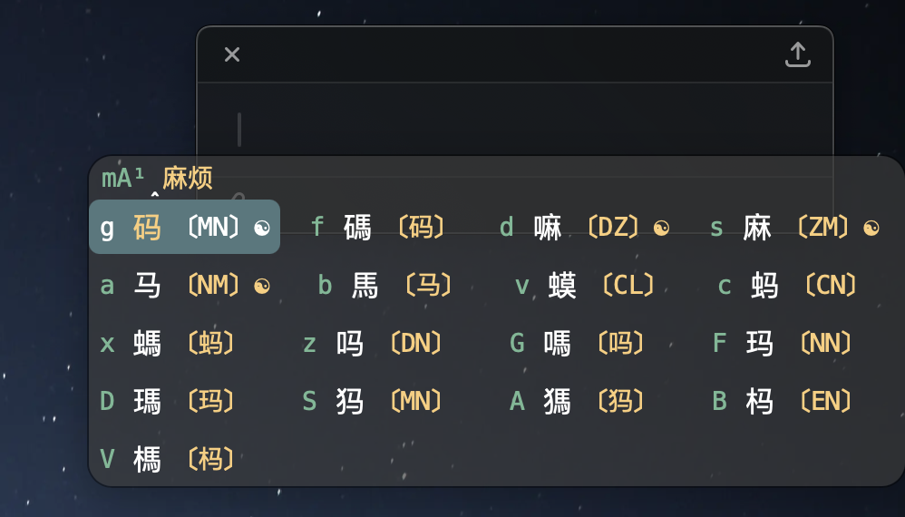

- 开启虎码拆分提示，使用<kbd>CTRL</kbd>+<kbd>a</kbd>快捷键。

  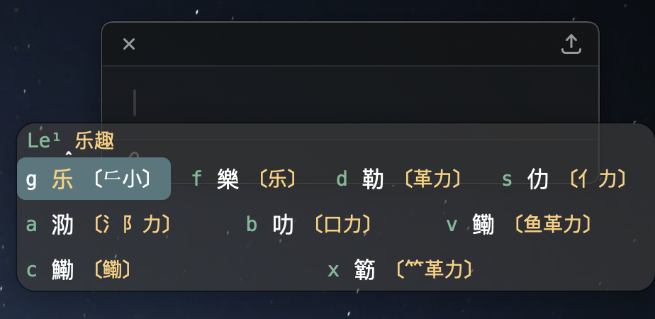

- 开启读音提示，使用<kbd>CTRL</kbd>+<kbd>s</kbd>快捷键。

  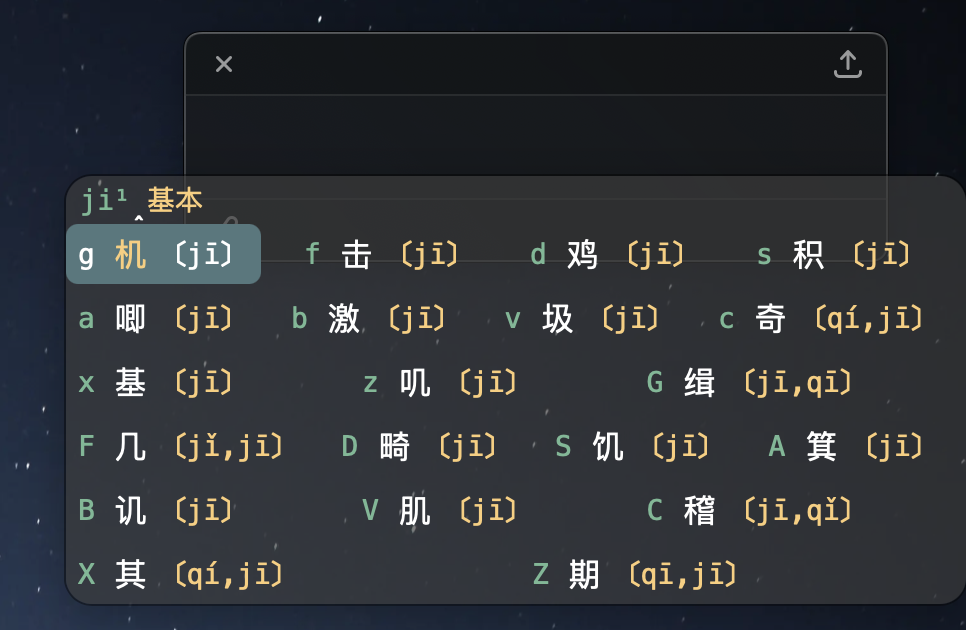

- 开启一击码提示，使用<kbd>CTRL</kbd>+<kbd>d</kbd>快捷键。

  

- 将当前词从用户词库中删除，使用<kbd>CTRL</kbd>+<kbd>x</kbd>快捷键。

- 使用<kbd>ENTER</kbd>，清空当前编码，等同于<kbd>ESC</kbd>。

- 使用<kbd>UP</kbd>向上翻页，<kbd>DOWN</kbd>向下翻页。
-
- 使用<kbd>LEFT</kbd>选择上一个候选词，<kbd>RIGHT</kbd>选择下一个候选词。
